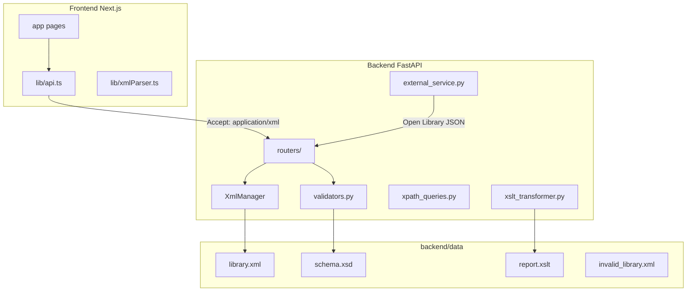
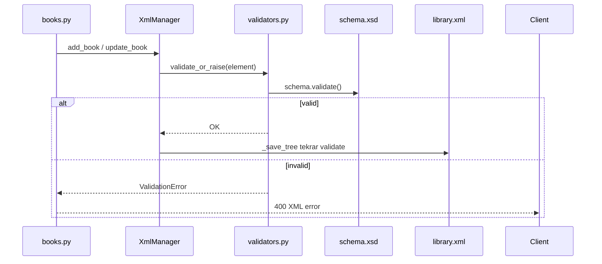
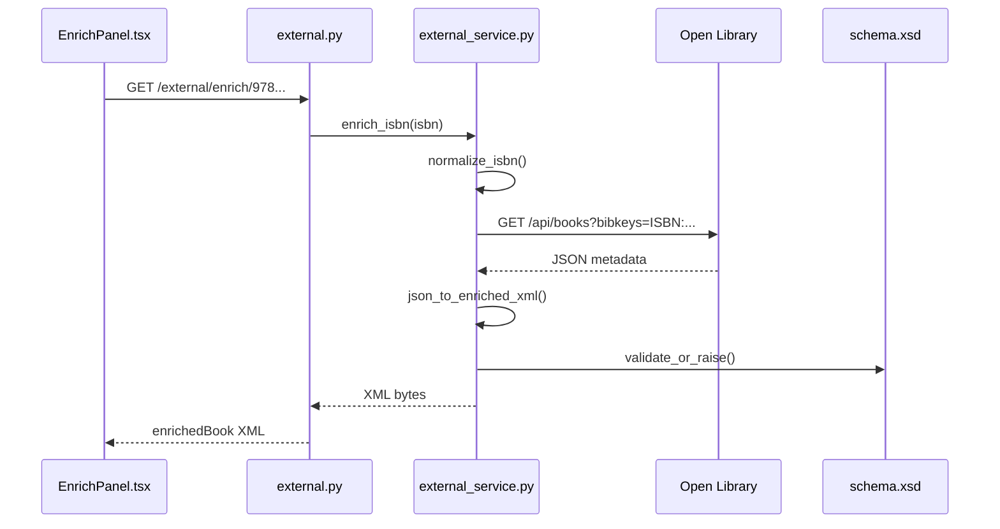

# örneközet.md — [DEVRE DIŞI / ESKİ SÜRÜM]

> ⚠️ **Bu dosya artık kullanılmıyor.** Video sunumu için güncel, ödev şartnamesindeki tüm maddelere (A-G, kalite gereksinimleri, kanıt kontrol listesi, zaman planı, ekranda-ne-gösterileceği talimatları) birebir eşlenmiş konuşma metni için:
>
> ### 👉 [`video_sunum_konusma_metni.md`](./video_sunum_konusma_metni.md) dosyasına bakın.
>
> Aşağıdaki içerik sadece referans/arşiv amaçlı bırakılmıştır, video çekiminde bu dosyayı **kullanmayın**.

---

# örneközet.md — Video Sunum Rehberi (Kopya Kağıdı) — ESKİ SÜRÜM

> **Proje:** XML-Based Library Management System (Mersin Üniversitesi — XML ve Web Servisleri)  
> **Amaç:** Bu dosya, videoda kodu satır satır anlatırken önüne koyacağın senaryo. Teknik terimler İngilizce kalabilir; anlatım Türkçe + günlük dil karışık.  
> **Stack:** Backend = Python + FastAPI + lxml | Frontend = Next.js + React | Veri = `library.xml`

---

## İçindekiler

1. [XML Basics for Dummies](#bölüm-1--xml-basics-for-dummies)
2. [Data Structure (XML Veri Paketi)](#bölüm-2--data-structure-xml-veri-paketi)
3. [XSD Validation (Şema Doğrulama)](#bölüm-3--xsd-validation-şema-doğrulama)
4. [Data Query & Transformation (XPath + XSLT)](#bölüm-4--data-query--transformation-xpath--xslt)
5. [XML Parsing in Code (DOM + iterparse)](#bölüm-5--xml-parsing-in-code-dom--iterparse)
6. [REST API Endpoints](#bölüm-6--rest-api-endpoints)
7. [External Integration (Open Library)](#bölüm-7--external-integration-open-library)
8. [Class-by-Class & Line-by-Line Walkthrough](#bölüm-8--class-by-class--line-by-line-walkthrough)
9. [Hata Yönetimi Deep Dive](#bölüm-9--hata-yönetimi-deep-dive)
10. [Video Çekim Cheat Sheet](#bölüm-10--video-çekim-cheat-sheet)

---

## Mimari Özet (Videonun başında göster)



**Videoda söyle:**  
*"Bizim mimaride ayrı bir Java Controller/Service katmanı yok. FastAPI **router** dosyaları HTTP isteğini alıyor, iş mantığını **XmlManager** sınıfına devrediyor, veri tek bir **library.xml** dosyasında duruyor. XSD her yazmadan önce dosyayı koruyor."*

---

# BÖLÜM 1 — XML Basics for Dummies

## 1.1 XML nedir?

**XML (eXtensible Markup Language)** = etiketlerle yazılmış veri dosyası.

JSON ile karşılaştır:

```json
{
  "title": "Dune",
  "author": "Frank Herbert"
}
```

Aynı veri XML'de:

```xml
<book id="bk-003" isbn="978-0-44-101359-5">
  <title>Dune</title>
  <author>Frank Herbert</author>
</book>
```

**Buradaki mantığımız şu:** Ders projesi XML odaklı olduğu için veritabanı (MySQL vb.) yerine tüm kütüphane verisini **`backend/data/library.xml`** dosyasında tutuyoruz. API hem okur hem yazar — hep XML formatında.

---

## 1.2 XSD (XML Schema Definition) nedir?

**XSD = XML için kural kitabı / şema.**

- Hangi tag'ler olabilir?
- Hangi sırayla gelmeli?
- ISBN formatı doğru mu?
- `bookRef` gerçekten var olan bir kitap ID'sine mi işaret ediyor?

**Projede:** `backend/data/schema.xsd`

**Analoji:** XSD olmadan herkes `<horror>` diye kategori yazar, `-5` kopya girer, olmayan kitaba referans verir → sistem çöker. XSD bunu **kaydetmeden önce** yakalar.

---

## 1.3 XPath nedir?

**XPath = XML içinde arama dili** (SQL'deki SELECT gibi düşün).

Örnek: *"Sci-Fi kategorisindeki tüm kitapları getir"*

```
/library/books/book[categories/category='Sci-Fi']
```

**Projede:** `backend/src/xpath_queries.py` — 6 adet demo sorgu.

---

## 1.4 XSLT nedir?

**XSLT = XML'i başka formata dönüştürme** (bizde XML → HTML dashboard).

**Projede:**
- `backend/data/report.xslt` — dönüşüm kuralları
- `backend/src/xslt_transformer.py` — Python'dan XSLT çalıştırma
- Endpoint: `GET /api/v1/reports/dashboard` → tarayıcıda HTML rapor

**Here we are doing this because:** Ham XML'i hocaya/ kullanıcıya göstermek zor; XSLT ile otomatik güzel bir rapor sayfası üretiyoruz.

---

## 1.5 REST API nedir?

**REST = HTTP metodlarıyla kaynak yönetimi:**

| Method | Anlam | Bizde örnek |
|--------|-------|-------------|
| GET | Oku | Kitap listesi |
| POST | Oluştur | Yeni kitap ekle |
| PUT | Güncelle | Kitap düzenle |
| DELETE | Sil | Kitap sil |

**Projede:** `backend/src/routers/` altında `books.py`, `members.py`, `borrowings.py`, `reports.py`, `external.py`

**Önemli:** Bizim API **XML-only** — yani JSON değil, `Accept: application/xml` ve body'de XML bekliyoruz.

---

## 1.6 Frontend tarafında XML

Tarayıcıda da XML parse ediyoruz:

- **`frontend/lib/api.ts`** — fetch ile backend'e istek, header'lar
- **`frontend/lib/xmlParser.ts`** — `DOMParser` ile XML → JavaScript objesi

**Videoda söyle:**  
*"Backend lxml kullanıyor, frontend tarayıcının yerleşik DOMParser'ını kullanıyor. İkisi de aynı `<book>` yapısını okuyor; sadece dil farklı — Python vs TypeScript."*

---

# BÖLÜM 2 — Data Structure (XML Veri Paketi)

## 2.1 Ana dosya: `library.xml`

**Konum:** `backend/data/library.xml`  
**Kayıt sayıları (PDF gereksinimi ≥25 kayıt karşılanıyor):**

| Bölüm | Adet | ID formatı |
|-------|------|------------|
| Kitaplar (`book`) | **28** | `bk-001` … `bk-028` |
| Üyeler (`member`) | **9** | `mem-001` … `mem-009` |
| Ödünçler (`borrowing`) | **12** | `brw-001` … `brw-012` |

Kök eleman:

```xml
<library id="lib-001" name="Mersin University Digital Library" ...>
  <books>...</books>
  <members>...</members>
  <borrowings>...</borrowings>
</library>
```

---

## 2.2 İç içe (nested) yapı — kitap örneği

```xml
<book id="bk-001" isbn="978-0-13-468599-1">
  <title>Effective Java</title>
  <author>Joshua Bloch</author>
  <publisher>Addison-Wesley</publisher>
  <categories>
    <category>Technology</category>
  </categories>
  <publicationYear>2018</publicationYear>
  <availableCopies>5</availableCopies>
  <description>Best practices for the Java programming language.</description>
</book>
```

**Buradaki mantığımız şu:**
- `id` ve `isbn` **attribute** (etiketin üstünde `@id`, `@isbn`)
- `title`, `author` vb. **child element** (iç içe tag)
- `categories` içinde birden fazla `category` olabilir (ör. bk-005 hem Classic hem Sci-Fi)

---

## 2.3 Üye yapısı

```xml
<member id="mem-001">
  <firstName>Ahmet</firstName>
  <lastName>Yılmaz</lastName>
  <email>ahmet@mersin.edu.tr</email>
  <membershipType>student</membershipType>
  <joinDate>2024-09-01</joinDate>
</member>
```

**camelCase kuralı:** `firstName`, `lastName`, `membershipType`, `joinDate` — XSD bunu zorunlu kılıyor. `first_name` yazarsan validation fail.

---

## 2.4 Ödünç (borrowing) ve referanslar

```xml
<borrowing id="brw-001" bookRef="bk-003" memberRef="mem-001">
  <borrowDate>2026-06-01</borrowDate>
  <dueDate>2026-07-01</dueDate>
  <status>active</status>
</borrowing>
```

**ID / IDREF sistemi (`schema.xsd`):**

| Attribute | XSD tipi | Ne işe yarar |
|-----------|----------|--------------|
| `book/@id` | `xs:ID` | Benzersiz kitap kimliği |
| `member/@id` | `xs:ID` | Benzersiz üye kimliği |
| `borrowing/@id` | `xs:ID` | Benzersiz ödünç kaydı |
| `bookRef` | `xs:IDREF` | Var olan bir `book/@id`'ye pointer |
| `memberRef` | `xs:IDREF` | Var olan bir `member/@id`'ye pointer |

**Örnek join senaryosu (brw-001):**
- `bookRef="bk-003"` → Dune kitabı
- `memberRef="mem-001"` → o üye
- XPath'te: `/library/books/book[@id='bk-003']`
- XSLT'te: `/library/books/book[@id=current()/@bookRef]/title`

**Videoda söyle:**  
*"Relational DB'deki foreign key gibi düşün: `bookRef` başka tabloya değil, aynı XML dosyasındaki kitap ID'sine bağlanıyor. XSD `IDREF` sayesinde olmayan ID yazılamaz."*

---

## 2.5 Adlandırma kuralları özeti

| Kural | Örnek |
|-------|-------|
| Kitap ID | `bk-001`, `bk-028` |
| Üye ID | `mem-001` |
| Ödünç ID | `brw-001` |
| ISBN pattern | `978-0-13-468599-1` (`isbnType`) |
| Kategori enum | Sci-Fi, Fantasy, Technology, Classic, ... |
| Üyelik tipi | student, faculty, public |
| Ödünç durumu | active, returned, overdue |

---

**Videoda söyle (Bölüm 2 kapanış):**  
*"28 kitap, 9 üye, 12 ödünç kaydı var. Hepsi tek XML'de nested yapıda. Referanslar `bookRef` ve `memberRef` ile kuruluyor; XSD bunların geçerli ID olduğunu kontrol ediyor."*

---

# BÖLÜM 3 — XSD Validation (Şema Doğrulama)

## 3.1 Doğrulama nerede yapılıyor?

Ana modül: **`backend/src/validators.py`**

| Fonksiyon / Sınıf | Satır | Görevi |
|-------------------|-------|--------|
| `ValidationError` | 11–16 | XSD fail olunca fırlatılan exception; `.log` alanında detay |
| `_load_schema()` | 19–21 | `schema.xsd` dosyasını parse eder |
| `get_schema()` | 27–31 | Şemayı cache'ler (her seferinde diskten okumaz) |
| `validate_xml()` | 34–64 | `(True, "")` veya `(False, error_log)` döner |
| `validate_or_raise()` | 67–70 | Geçmezse `ValidationError` fırlatır |
| `validate_file_pair()` | 73–84 | Geçerli + geçersiz dosyayı demo için karşılaştırır |

**Buradaki mantığımız şu:** `validate_xml` yumuşak kontrol (bool döner); `validate_or_raise` sert kontrol (exception). CRUD işlemlerinde sert olanı kullanıyoruz çünkü bozuk veriyi diske yazmak istemiyoruz.

---

## 3.2 Doğrulama akış diyagramı



---

## 3.3 `validate_xml()` adım adım

1. `get_schema()` ile XSD yüklenir
2. Girdi tipine göre parse:
   - `etree._Element` → direkt element
   - `Path` → `etree.parse(path)`
   - `bytes` / `str` → `etree.fromstring()`
3. `schema.validate(element)` çağrılır
4. `XMLSyntaxError` → `"Malformed XML: ..."` mesajı (XML bile okunamıyor)
5. Başarısızsa `schema.error_log` string olarak döner

**Videoda ekranda göster:** `validators.py` satır 34–64, özellikle `try/except etree.XMLSyntaxError` bloğu.

---

## 3.4 Doğrulama çağrı noktaları (gerçek kod)

| Ne zaman | Dosya | Fonksiyon |
|----------|-------|-----------|
| Uygulama açılışı | `main.py` | `lifespan` → `validate_xml(LIBRARY_XML)` |
| Startup demo | `main.py` | `validate_file_pair(LIBRARY_XML, INVALID_LIBRARY_XML)` |
| Demo endpoint | `main.py` | `GET /api/v1/validation/demo` |
| Diske yazmadan önce | `xml_manager.py` | `_save_tree()` → `validate_or_raise(tree.getroot())` |
| Kitap ekleme | `xml_manager.py` | `add_book()` → `validate_or_raise(book_element)` |
| Kitap güncelleme | `xml_manager.py` | `update_book()` → `validate_or_raise(updated)` |
| Üye ekleme/güncelleme | `xml_manager.py` | `add_member()`, `update_member()` |
| Open Library zenginleştirme | `external_service.py` | `json_to_enriched_xml()` → `validate_or_raise(root)` |

**Here we are doing this because:** `_save_tree` hem eleman hem tüm belgeyi doğruluyor — tek hatalı `<book>` tüm `library.xml`'i bozamasın diye.

---

## 3.5 Geçersiz XML: `invalid_library.xml`

**Dosya:** `backend/data/invalid_library.xml`  
**Amaç:** XSD demosu — kasıtlı olarak bozuk.

| # | Hata | Dosyada ne var | XSD kuralı |
|---|------|----------------|------------|
| 1 | Geçersiz ISBN | `isbn="NOT-A-VALID-ISBN"` | `isbnType` pattern |
| 2 | Geçersiz kategori | `<category>Horror</category>` | `genreType` enum |
| 3 | Absürt yıl | `<publicationYear>99999</publicationYear>` | mantıksal üst sınır |
| 4 | Geçersiz email | `not-an-email` | `emailType` pattern |
| 5 | Duplicate ID | iki kez `id="bk-dup"` | `xs:ID` benzersizlik |
| 6 | Var olmayan referans | `bookRef="bk-missing"` | `xs:IDREF` |
| 7 | Negatif kopya | `availableCopies=-5` | `nonNegativeInteger` |
| 8 | Geçersiz üyelik | `membershipType=vip` | enum |
| 9 | Geçersiz status | `status=cancelled` | borrowingStatusType |

**Demo:** Tarayıcıda `http://localhost:8000/api/v1/validation/demo` → JSON:

```json
{
  "valid_result": true,
  "invalid_result": false,
  "invalid_log": "... schema error details ..."
}
```

---

## 3.6 API hata yanıtı formatı

Geçersiz XML POST edildiğinde (ör. `POST /api/v1/books`):

**HTTP 400** + body:

```xml
<?xml version='1.0' encoding='UTF-8'?>
<error>
  <code>400</code>
  <message>Schema validation failed</message>
  <detail>Element 'category': [facet 'enumeration'] ...</detail>
</error>
```

**Üreten kod:**
- `xml_responses.py` → `build_error_xml(code, message, detail)`
- `responses.py` → `xml_error_response(...)` → FastAPI `Response`
- `books.py` → `create_book` içinde:

```python
except ValidationError as exc:
    return xml_error_response(400, str(exc), exc.log[:500] if exc.log else "")
```

**Buradaki mantığımız şu:** Hata mesajı da XML — çünkü API'miz JSON konuşmuyor. Frontend `handleResponse` içinde `<message>` ve `<detail>` parse ediyor.

---

**Videoda söyle (Bölüm 3 kapanış):**  
*"Her kayıt diske gitmeden önce `validate_or_raise` ile `schema.xsd`'ye soruyoruz. `invalid_library.xml` bilerek bozuk — demo endpoint'te geçerli dosya PASS, geçersiz FAIL gösteriyoruz."*

---

# BÖLÜM 4 — Data Query & Transformation (XPath + XSLT)

## 4.1 XPath modülü: `xpath_queries.py`

Tüm sorgular `library.xml`'i `_load_tree()` ile DOM'a yükleyip `tree.xpath(...)` çalıştırır.

---

### Sorgu 1 — `query_scifi_books_by_author()`

**XPath:**
```
/library/books/book[categories/category='Sci-Fi']
```

**Ne işe yarar:** Sci-Fi kategorili kitapları bulur.  
**Neden:** Predicate `[...]` ile filtreleme — dersin XPath predicate konusu.  
**Ek:** Python'da `sorted(books, key=lambda b: b.findtext("author"))` ile yazara göre sıralar.

**Örnek sonuç:** Dune (bk-003), 1984 (bk-005), vb.

---

### Sorgu 2 — `query_category_counts()`

**XPath (kategori listesi):**
```
/library/books/book/categories/category/text()
```

**XPath (her kategori için sayım):**
```
count(/library/books/book[categories/category='Sci-Fi'])
```

**Ne işe yarar:** Her genre kaç kitapta geçiyor — dashboard istatistiği.  
**Neden:** `count()` XPath fonksiyonu demo ediliyor.

---

### Sorgu 3 — `query_title_search(keyword)`

**XPath:**
```
/library/books/book[contains(translate(title, 'ABCDEFGHIJKLMNOPQRSTUVWXYZ', 'abcdefghijklmnopqrstuvwxyz'), 'the')]
```

**Ne işe yarar:** Başlıkta "the" geçen kitaplar (case-insensitive).  
**Neden:** `contains()` + `translate()` — büyük/küçük harf duyarsız arama. API'deki `search` parametresi de benzer mantık kullanıyor (`xml_manager.get_all_books`).

**Demo:** `run_all_queries()` içinde keyword `"the"`.

---

### Sorgu 4 — `query_active_borrowed_books()`

**XPath (ödünçler):**
```
/library/borrowings/borrowing[status='active']
```

**XPath (join — kitap):**
```
/library/books/book[@id='{book_ref}']
```

**XPath (join — üye):**
```
/library/members/member[@id='{member_ref}']
```

**Ne işe yarar:** Aktif ödünçleri kitap başlığı + üye adıyla listeler.  
**Neden:** IDREF ilişkisini XPath ile join etmek — relational DB'deki JOIN analojisi.

**DİKKAT:** `status` bir **element** (`<status>active</status>`), attribute değil. Doğru: `status='active'`. Yanlış: `@status='active'`.

---

### Sorgu 5 — `query_publisher_books_after_year(publisher, year)`

**XPath:**
```
/library/books/book[publisher='Penguin Classics' and publicationYear > 1900]
```

**Ne işe yarar:** Belirli yayınevi + yıl filtresi (chained predicates).  
**Demo:** `run_all_queries()` → `("Penguin Classics", 1900)`.

---

### Sorgu 6 — `query_overdue_borrowings()`

**XPath:**
```
/library/borrowings/borrowing[status='overdue']
```

**Ne işe yarar:** Gecikmiş ödünçleri listeler.  
**Not:** `sync_overdue_status()` aktif kayıtları vade geçince `overdue` yapar.

---

### XPath endpoint

**URL:** `GET /api/v1/reports/xpath`  
**Header:** `Accept: application/xml`  
**Kod:** `reports.py` → `xpath_demo()` → `run_all_queries()` → XML `<xpathResults>` wrapper

**Videoda söyle:**  
*"Altı XPath sorgumuz var — PDF'te en az 5 isteniyor, biz 6 yaptık. Hepsini `/reports/xpath` endpoint'i tek XML'de döndürüyor."*

---

## 4.2 XSLT dönüşümü

### Python tarafı — `xslt_transformer.py`

```python
def transform_to_html() -> str:
    xml_doc = etree.parse(str(LIBRARY_XML))
    xslt_doc = etree.parse(str(REPORT_XSLT))
    transform = etree.XSLT(xslt_doc)
    result = transform(xml_doc)
    return str(result)
```

**Adım adım:**
1. `library.xml` DOM'a yüklenir
2. `report.xslt` stylesheet yüklenir
3. `etree.XSLT(xslt_doc)` transform motoru oluşturulur
4. `transform(xml_doc)` çalışır → HTML string
5. `reports.py` → `dashboard_report()` → `HTMLResponse`

**Here we are doing this because:** XSLT sunucuda çalışır; istemci sadece hazır HTML alır.

---

### `report.xslt` — ne üretiyor?

**Kök template:** `<xsl:template match="/">` → tam HTML sayfa

**6 istatistik kartı:**

| Kart | XPath ifadesi |
|------|---------------|
| Total Books | `count(/library/books/book)` |
| Registered Members | `count(/library/members/member)` |
| Active Borrowings | `count(...borrowing[status='active'])` |
| Overdue Items | `count(...borrowing[status='overdue'])` |
| Sci-Fi Books | `count(...book[categories/category='Sci-Fi'])` |
| Total Available Copies | `sum(...book/availableCopies)` |

**3 tablo:**

1. **Book Catalog** — `xsl:for-each select="/library/books/book"`, `xsl:sort select="title"`
2. **Active & Overdue Borrowings** — IDREF join:
   ```xml
   /library/books/book[@id=current()/@bookRef]/title
   /library/members/member[@id=current()/@memberRef]/firstName
   ```
3. **Members Overview** — her üye için aktif+gecikmiş ödünç sayısı:
   ```
   count(/library/borrowings/borrowing[@memberRef=current()/@id and (status='active' or status='overdue')])
   ```

**ÖNEMLİ BUG FIX (videoda mutlaka de):**  
Eskiden `@status='active'` kullanılıyordu — `status` attribute değil **child element**. Bu yüzden dashboard'da Active Loans hep 0 görünüyordu. Düzeltme: `status='active'` (4 yerde).

**Frontend:** `frontend/app/reports/page.tsx` → iframe ile `getReportDashboardUrl()` gösterir.

---

**Videoda söyle (Bölüm 4 kapanış):**  
*"XPath ile veriyi sorguluyoruz, XSLT ile aynı XML'den HTML dashboard üretiyoruz. İkisi de `library.xml`'i kaynak alıyor — tek truth source."*

---

# BÖLÜM 5 — XML Parsing in Code (DOM + iterparse)

## 5.1 Hangi parsing yaklaşımını kullandık?

Java dünyasında **DOM**, **SAX**, **StAX** vardır. Biz **Python lxml** kullanıyoruz:

| Yaklaşım | Java karşılığı | Bizde nerede |
|----------|----------------|--------------|
| **DOM** | DOM | `etree.parse()` — tüm ağaç bellekte |
| **Streaming** | SAX-benzeri | `etree.iterparse()` — olay tabanlı, parça parça |

**StAX kullanmıyoruz** — Python ekosisteminde lxml + iterparse yeterli.

Ana sınıf: **`XmlManager`** (`backend/src/xml_manager.py`)

---

## 5.2 DOM parsing — okuma ve değiştirme

### `load_tree()` (satır 37–39)

```python
def load_tree(self) -> etree._ElementTree:
    return etree.parse(str(self.xml_path))
```

**Ne yapar:** `library.xml`'in tamamını belleğe yükler.  
**Ne zaman:** CRUD, XPath filtre, güncelleme — rastgele erişim gerektiğinde.

### `get_root()` (satır 41–42)

Kök `<library>` elemanını döner.

### Okuma örneği — `get_book_by_id()` (satır 104–109)

```python
tree = self.load_tree()
results = tree.xpath(f"/library/books/book[@id='{book_id}']")
if not results:
    raise BookNotFoundError(...)
return copy.deepcopy(results[0])
```

**Buradaki mantığımız şu:** `deepcopy` ile orijinal ağaç bozulmaz — sadece kopya döneriz.

### Yazma — `add_book()` (satır 241–259)

1. `load_tree()` — DOM yükle
2. `books_container.append(book_element)` — yeni kitap ekle
3. `validate_or_raise(book_element)` — XSD kontrol
4. `_save_tree(tree)` — diske yaz + tekrar validate

### `_save_tree()` (satır 178–186)

```python
def _save_tree(self, tree):
    validate_or_raise(tree.getroot())
    tree.write(str(self.xml_path), pretty_print=True, ...)
```

**Here we are doing this because:** Her değişiklikten sonra XML dosyası güncellenir — veritabanı yok, dosya = database.

---

## 5.3 Streaming parsing — `iterparse` (SAX-like)

### `stream_books()` (satır 46–68)

```python
context = etree.iterparse(str(self.xml_path), events=("end",), tag="book")
for _event, elem in context:
    yield {"id": elem.get("id"), "title": elem.findtext("title"), ...}
    elem.clear()  # bellek temizliği
    while elem.getprevious() is not None:
        del elem.getparent()[0]
```

**Ne yapar:** Her `<book>` bitince tetiklenir; kitap bilgisini yield eder; sonra elem'i bellekten siler.  
**Neden:** 10.000 kitap olsa bile tüm DOM'u yüklemeden sayabilirsin.

### `count_books_streaming()` (satır 70–72)

```python
return sum(1 for _ in self.stream_books())
```

### Startup'ta kullanım — `main.py` lifespan (satır 34–35)

```python
count = manager.count_books_streaming()
logger.info("Streaming book count via iterparse: %d", count)
```

**Videoda söyle:**  
*"Uygulama açılırken iterparse ile kitap sayısını logluyoruz — DOM yüklemeden streaming demo."*

---

## 5.4 Gelen HTTP body parse — `parse_*_xml`

| Fonksiyon | Satır | Kök tag |
|-----------|-------|---------|
| `parse_book_xml` | 297–310 | `<book>` |
| `parse_member_xml` | 376–386 | `<member>` |
| `parse_borrowing_xml` | 530–540 | `<borrowing>` |

**Ortak pattern:**

```python
try:
    element = etree.fromstring(xml_bytes)
except etree.XMLSyntaxError as exc:
    raise ValueError(f"Malformed XML: {exc}") from exc
```

**Buradaki mantığımız şu:** Bozuk XML syntax → `XMLSyntaxError` → `ValueError` → router 400 döner. XSD'den önce syntax kontrolü.

---

## 5.5 XmlManager metod grupları (hızlı referans)

| Grup | Metodlar |
|------|----------|
| DOM load/save | `load_tree`, `get_root`, `_save_tree` |
| Streaming | `stream_books`, `count_books_streaming` |
| Kitap read | `get_all_books`, `get_book_by_id` |
| Kitap write | `add_book`, `update_book`, `delete_book`, `parse_book_xml` |
| Üye | `get_all_members`, `get_member_by_id`, `add_member`, `update_member`, `delete_member`, `parse_member_xml` |
| Ödünç | `get_all_borrowings`, `get_borrowing_by_id`, `checkout_book`, `return_book`, `update_borrowing`, `delete_borrowing`, `parse_borrowing_xml` |
| İş kuralları | `sync_overdue_status`, `count_active_loans`, `_ensure_references_exist`, `_ensure_unique_email` |
| ID üretimi | `_next_id`, `_next_book_id`, `_next_member_id`, `_next_borrowing_id` |

---

## 5.6 Frontend XML parsing

**Dosya:** `frontend/lib/xmlParser.ts`

| Fonksiyon | Ne yapar |
|-----------|----------|
| `parseBooksXml(xml)` | `DOMParser` → `Book[]` |
| `parseMembersXml(xml)` | `Member[]` |
| `parseBorrowingsXml(xml)` | `Borrowing[]` |
| `serializeBookToXml(data)` | Form → XML string (POST body) |
| `serializeMemberToXml(data)` | Üye formu → XML |
| `serializeCheckoutToXml(data)` | Ödünç checkout XML |
| `parseCollectionMeta(xml)` | `totalCount` attribute (CORS fallback) |

**Escape fonksiyonu:** `&`, `<`, `>`, `"` karakterleri XML injection'a karşı escape edilir.

---

**Videoda söyle (Bölüm 5 kapanış):**  
*"Backend'de lxml DOM ile okuyup yazıyoruz, iterparse ile streaming demo yapıyoruz. Frontend'de tarayıcı DOMParser kullanıyor — aynı `<book>` yapısı, iki tarafta parse/serialize."*

---

# BÖLÜM 6 — REST API Endpoints

## 6.1 Genel kurallar

**Base URL:** `http://localhost:8000/api/v1`  
**Prefix:** `main.py` satır 59–64 → tüm router'lar `/api/v1` altında

### Header'lar (`auth.py`)

| Header | Zorunlu | Ne zaman | Yoksa |
|--------|---------|----------|-------|
| `Accept: application/xml` | Evet (çoğu endpoint) | GET/POST/PUT/DELETE | **406** Not Acceptable |
| `X-API-Key: library-api-key-dev-2026` | Evet | POST, PUT, DELETE | **401** Unauthorized |
| `Content-Type: application/xml` | Önerilen | POST/PUT body | Body ham XML okunur |

**Kod:**
- `require_xml_accept(request)` — Accept header kontrol
- `require_api_key(x_api_key)` — API key kontrol

---

## 6.2 Endpoint 1 — GET liste: `list_books`

**URL:** `GET /api/v1/books?genre=Sci-Fi&search=dune&page=1&limit=10`  
**Dosya:** `backend/src/routers/books.py` → `list_books()`  
**Auth:** Sadece `Accept: application/xml`

**Akış:**
1. Query params: `genre`, `search`, `page`, `limit`
2. `manager.get_all_books(...)` → XPath filtre + sayfalama
3. `books_collection_xml(books, total=total)` → XML wrapper
4. Response header: `X-Total-Count`, `X-Page`, `X-Limit`

**Örnek response (kısaltılmış):**

```xml
<?xml version='1.0' encoding='UTF-8'?>
<books count="10" totalCount="28">
  <book id="bk-003" isbn="978-0-44-101359-5">
    <title>Dune</title>
    ...
  </book>
</books>
```

**Frontend:** `fetchBooks()` → `parseBooksXml()` + header'dan total

**Videoda söyle:**  
*"GET liste endpoint'imiz XML collection döndürüyor. `totalCount` attribute ve `X-Total-Count` header ile dashboard'daki toplam kitap sayısını gösteriyoruz."*

---

## 6.3 Endpoint 2 — GET tek kayıt: `get_book`

**URL:** `GET /api/v1/books/bk-001`  
**Fonksiyon:** `get_book(book_id)`  
**Başarı:** Tek `<book>` XML  
**Hata:** `BookNotFoundError` → 404:

```xml
<error>
  <code>404</code>
  <message>Book not found</message>
  <detail>id=bk-999</detail>
</error>
```

---

## 6.4 Endpoint 3 — POST oluşturma: `create_book`

**URL:** `POST /api/v1/books`  
**Headers:**
```
Accept: application/xml
Content-Type: application/xml
X-API-Key: library-api-key-dev-2026
```

**Body örneği:**

```xml
<?xml version="1.0" encoding="UTF-8"?>
<book isbn="978-0-14-143951-8">
  <title>Test Book</title>
  <author>Test Author</author>
  <publisher>Test Pub</publisher>
  <categories><category>Classic</category></categories>
  <publicationYear>2020</publicationYear>
  <availableCopies>3</availableCopies>
</book>
```

**Akış (`create_book`):**
1. `body = await request.body()` — ham XML al
2. `manager.parse_book_xml(body)` — DOM element
3. `manager.add_book(book_element)` — ID otomatik (`bk-029`), XSD, diske yaz
4. **201 Created** + oluşturulan kitap XML

**try/except:**
- `ValidationError` → 400 + XSD log
- `ValueError` → 400 (duplicate id, malformed xml)

---

## 6.5 Endpoint 4 — PUT güncelleme: `update_book`

**URL:** `PUT /api/v1/books/bk-001`  
**Fonksiyon:** `update_book(book_id, request)`  
**Mantık:** Eski `<book>` DOM'dan silinir, yeni element aynı index'e konur, `_save_tree`.

---

## 6.6 Endpoint 5 — DELETE silme: `delete_book`

**URL:** `DELETE /api/v1/books/bk-001`  
**İş kuralı:** Aktif/gecikmiş ödünç varsa silinemez → `ValueError` → 400

**Başarı response:**

```xml
<result>
  <message>Book deleted successfully</message>
  <id>bk-001</id>
</result>
```

---

## 6.7 Diğer endpoint'ler (özet tablo)

| Method | Path | Router fonksiyonu | Not |
|--------|------|-------------------|-----|
| GET | `/members` | `list_members` | `membershipType`, `search` filter |
| POST | `/members` | `create_member` | API Key |
| PUT | `/members/{id}` | `update_member` | |
| DELETE | `/members/{id}` | `delete_member` | Aktif ödünç varsa engel |
| GET | `/borrowings` | `list_borrowings` | `status`, `memberRef`, `bookRef` |
| POST | `/borrowings` | `checkout_book` | Ödünç alma |
| PUT | `/borrowings/{id}/return` | `return_book` | İade |
| PUT | `/borrowings/{id}` | `update_borrowing` | |
| DELETE | `/borrowings/{id}` | `delete_borrowing` | Sadece `returned` |
| GET | `/reports/dashboard` | `dashboard_report` | HTML (XSLT) |
| GET | `/reports/xpath` | `xpath_demo` | XPath sonuçları XML |
| GET | `/external/enrich/{isbn}` | `enrich_book` | Open Library |
| GET | `/health` | `health` | JSON (istisna) |
| GET | `/validation/demo` | `validation_demo` | JSON XSD demo |

**Postman:** `postman/collection.json` — hazır istekler.

---

**Videoda söyle (Bölüm 6 kapanış):**  
*"API'miz RESTful: GET okur, POST oluşturur, PUT günceller, DELETE siler. Hepsi XML konuşuyor — Accept ve Content-Type application/xml. Yazma işlemleri X-API-Key ile korunuyor."*

---

# BÖLÜM 7 — External Integration (Open Library)

## 7.1 Ne entegre ettik?

**Harici servis:** [Open Library API](https://openlibrary.org) — ISBN ile kitap metadata (JSON).  
**Modül:** `backend/src/external_service.py`  
**Router:** `backend/src/routers/external.py` → `enrich_book(isbn)`  
**Endpoint:** `GET /api/v1/external/enrich/{isbn}`

**Buradaki mantığımız şu:** Kullanıcı ISBN girince dış API'den kitap bilgisi çekiyoruz, JSON'u XML'e çevirip XSD'den geçiriyoruz — sonra frontend'den kütüphaneye ekleyebiliyor.

---

## 7.2 Akış adım adım



---

## 7.3 Fonksiyonlar (`external_service.py`)

### `normalize_isbn(isbn)` (satır 21–34)

- Rakam dışı karakterleri temizler
- 13 haneli → `978-X-X-XXXXX-X` formatına çevirir
- 10 haneli ISBN → ISBN-13'e dönüştürür (check digit hesabı)

**Videoda söyle:** *"Kullanıcı ISBN'i tireli veya tiresiz girebilir — normalize ediyoruz."*

### `fetch_open_library(isbn)` (satır 37–66)

**Birincil istek:**
```
GET https://openlibrary.org/api/books?bibkeys=ISBN:{clean}&format=json&jscmd=data
```

- `httpx.AsyncClient` — async HTTP, timeout 15s
- `User-Agent` header — Open Library academic project için
- JSON'da kitap yoksa **fallback:** `GET /isbn/{clean}.json`
- 404 → `ValueError("ISBN not found...")`

### `_parse_books_api_data()` / `_parse_isbn_edition()`

JSON alanlarını Python dict'e map eder:
- `title`, `authors`, `publisher`, `publish_year`, `description`

Fallback'te yazar adı için ek istek: `GET {OPEN_LIBRARY_BASE}{author_key}.json`

### `json_to_enriched_xml(book_data)` (satır 132–148)

XML üretir:

```xml
<?xml version='1.0' encoding='UTF-8'?>
<enrichedBook isbn="978-0-14-143951-8">
  <title>Pride and Prejudice</title>
  <author>Jane Austen</author>
  <publisher>Penguin Classics</publisher>
  <publicationYear>1813</publicationYear>
  <description>...</description>
  <categories><category>Classic</category></categories>
  <source>Open Library API</source>
</enrichedBook>
```

Son satır: `validate_or_raise(root)` — `enrichedBookType` XSD'de tanımlı.

### `enrich_isbn(isbn)` (satır 151–154)

Tam pipeline: fetch → convert → validate → return bytes.

---

## 7.4 Router hata yönetimi (`external.py`)

```python
try:
    xml_bytes = await enrich_isbn(isbn)
    return xml_response(xml_bytes)
except ValueError as exc:
    return xml_error_response(404, str(exc), f"isbn={isbn}")
except httpx.HTTPError as exc:
    return xml_error_response(502, "External service unavailable", str(exc))
except ValidationError as exc:
    return xml_error_response(400, "Enriched data failed validation", exc.log[:500])
```

| Durum | HTTP | Mesaj |
|-------|------|-------|
| ISBN bulunamadı | 404 | ISBN not found |
| Open Library down | 502 | External service unavailable |
| XSD fail | 400 | Enriched data failed validation |

---

## 7.5 Frontend kullanımı

**Sayfa:** `frontend/app/enrich/page.tsx`  
**Bileşen:** `frontend/components/EnrichPanel.tsx`

1. Kullanıcı ISBN girer
2. `enrichIsbn(isbn)` → `api.ts`
3. `parseEnrichedBookXml(xml)` → form alanları dolar
4. `BookForm` ile `createBook(serializeBookToXml(...))` → kütüphaneye eklenir

**Videoda söyle:**  
*"External integration sadece okuma — Open Library'den veri çekip XML'e çeviriyoruz. Asıl kayıt yine POST /books ile library.xml'e yazılıyor."*

---

# BÖLÜM 8 — Class-by-Class & Line-by-Line Walkthrough

> **Video sırası önerisi:** config → main → auth → validators → xml_responses → library_rules → xml_manager → xpath → xslt → external → routers → frontend

---

## 8.1 `config.py` — Yapılandırma

**Görev:** Sabit yollar ve API key.

| Satır | Kod | Açıklama |
|-------|-----|----------|
| 5–10 | `LIBRARY_XML`, `SCHEMA_XSD`, `REPORT_XSLT`, `INVALID_LIBRARY_XML` | `backend/data/` altındaki dosya yolları |
| 12 | `API_KEY = "library-api-key-dev-2026"` | POST/PUT/DELETE için |
| 13–16 | `CORS_ORIGINS` | Frontend localhost:3000 |

**Buradaki mantığımız şu:** Path'leri tek yerde topluyoruz — dosya taşınsa sadece config değişir.

---

## 8.2 `main.py` — Uygulama giriş noktası

| Satır | Kod | Açıklama |
|-------|-----|----------|
| 24–36 | `lifespan()` | Startup: XSD validate library.xml, invalid demo, iterparse count |
| 39–48 | `FastAPI(...)` | App metadata, lifespan hook |
| 50–57 | `CORSMiddleware` | Frontend CORS + `expose_headers` (X-Total-Count) |
| 59–64 | `include_router(...)` | books, members, borrowings, reports, external |
| 67–69 | `health()` | JSON health check (XML değil — istisna) |
| 72–76 | `validation_demo()` | XSD demo JSON endpoint |
| 79–81 | `xml_http_exception_handler` | 401/406 → XML error |
| 84–90 | `global_exception_handler` | Yakalanmamış hata → 500 XML veya JSON |

**Videoda söyle:** *"main.py sadece router'ları bağlar ve global hata yakalar — iş mantığı burada değil."*

---

## 8.3 `auth.py` — Kimlik doğrulama

| Satır | Kod | Açıklama |
|-------|-----|----------|
| 10–14 | `XmlHttpException` | Custom exception: status_code, message, detail |
| 17–20 | `require_api_key()` | `X-API-Key` header zorunlu; yanlışsa 401 |
| 23–26 | `require_xml_accept()` | Accept'te `application/xml` veya `*/*` yoksa 406 |

**FastAPI Depends:** Router'larda `dependencies=[Depends(require_api_key), Depends(require_xml_accept)]`

---

## 8.4 `validators.py` — XSD (Bölüm 3'te detaylı)

Özet: `validate_or_raise` = CRUD'un güvenlik kapısı.

---

## 8.5 `responses.py` + `xml_responses.py` — Yanıt formatları

**responses.py:**
- `xml_response(content, status_code=200)` → `media_type=application/xml`
- `xml_error_response(code, message, detail)` → hata XML

**xml_responses.py:**
- `build_error_xml()` → `<error><code/><message/><detail/></error>`
- `element_to_bytes()` → lxml element → bytes
- `books_collection_xml()`, `members_collection_xml()`, `borrowings_collection_xml()` → liste wrapper + `count`/`totalCount` attribute

---

## 8.6 `library_rules.py` — İş kuralları

| Fonksiyon | Mantık |
|-----------|--------|
| `loan_limit(membership_type)` | student=5, faculty=10, public=3 |
| `loan_period_days(membership_type)` | student=14, faculty=30, public=21 gün |
| `default_due_date(membership_type)` | Bugün + loan period |

**Kullanıldığı yer:** `xml_manager.checkout_book()` — limit ve dueDate hesabı.

**Videoda söyle:** *"Gerçek kütüphane sistemlerindeki gibi öğrenci 5 kitap, akademisyen 10 kitap alabilir."*

---

## 8.7 `xml_manager.py` — Kalp (detaylı)

### Exception sınıfları (satır 17–26)
- `BookNotFoundError`, `MemberNotFoundError`, `BorrowingNotFoundError` → router 404

### `checkout_book()` (satır 390–450) — videoda mutlaka anlat

1. `bookRef`, `memberRef` zorunlu
2. `_ensure_references_exist` — IDREF geçerli mi
3. `availableCopies > 0` mı
4. `count_active_loans` vs `loan_limit(membershipType)`
5. Yeni `<borrowing>` element XSD sırasına göre oluşturulur
6. `availableCopies -= 1`
7. `_save_tree`

**Here we are doing this because:** Stok ve limit kontrolü XSD'de değil — business logic XmlManager'da.

### `return_book()` (satır 452–488)

- Status `returned` yapılır
- `returnDate` eklenir
- `availableCopies += 1`

### `sync_overdue_status()` (satır 225–239)

- `status='active'` ve `dueDate < bugün` → `status='overdue'`
- Değişiklik varsa diske yazar

### `delete_book()` / `delete_member()` (satır 280–374)

- Aktif ödünç varsa silme engellenir → `ValueError` → 400

---

## 8.8 `xpath_queries.py` — (Bölüm 4'te detaylı)

6 sorgu + `run_all_queries()` aggregator.

---

## 8.9 `xslt_transformer.py`

Tek fonksiyon `transform_to_html()` — 14 satır. lxml XSLT engine.

---

## 8.10 `external_service.py` — (Bölüm 7'de detaylı)

---

## 8.11 Router: `books.py`

| Fonksiyon | HTTP | try/except |
|-----------|------|------------|
| `list_books` | GET | — |
| `get_book` | GET | `BookNotFoundError` → 404 |
| `create_book` | POST | `ValidationError`, `ValueError` → 400 |
| `update_book` | PUT | 404, 400 |
| `delete_book` | DELETE | 404, 400 (aktif ödünç) |

**Ortak pattern POST/PUT:**
```python
body = await request.body()
book_element = manager.parse_book_xml(body)
created = manager.add_book(book_element)
return xml_response(element_to_bytes(created), status_code=201)
```

---

## 8.12 Router: `members.py`

`books.py` ile aynı CRUD pattern — `parse_member_xml`, `add_member`, vb.

---

## 8.13 Router: `borrowings.py`

| Fonksiyon | Özel not |
|-----------|----------|
| `checkout_book` | POST — circulation |
| `return_book` | PUT `/{id}/return` — body yok |
| `delete_borrowing` | Sadece returned kayıtlar silinebilir |

---

## 8.14 Router: `reports.py`

- `dashboard_report()` → HTML, Accept XML gerekmez
- `xpath_demo()` → `run_all_queries()` → `<xpathResults>` XML

---

## 8.15 Router: `external.py`

- `enrich_book(isbn)` → async Open Library

---

## 8.16 Frontend — `lib/api.ts`

| Fonksiyon | Backend endpoint |
|-----------|------------------|
| `fetchBooks` | GET /books |
| `createBook` | POST /books + API Key |
| `fetchMembers` | GET /members |
| `checkoutBook` | POST /borrowings |
| `returnBook` | PUT /borrowings/{id}/return |
| `enrichIsbn` | GET /external/enrich/{isbn} |
| `handleResponse` | Hata XML parse → `ApiError` throw |

**XML_HEADERS:** Accept + Content-Type application/xml

---

## 8.17 Frontend — `lib/xmlParser.ts`

Parse: API XML → TypeScript interface  
Serialize: Form data → XML string (POST body)

**Önemli:** `serializeBookToXml` — ISBN attribute zorunlu (XSD `isbnType`).

---

## 8.18 Frontend sayfalar ve bileşenler

| Dosya | Ne yapar |
|-------|----------|
| `app/page.tsx` | Dashboard — kitap/üye/ödünç listesi, silme |
| `app/books/new/page.tsx` | Yeni kitap — `BookForm` |
| `app/members/page.tsx` | Üye CRUD — `MemberForm`, `MemberList` |
| `app/borrowings/page.tsx` | Ödünç listesi, iade — `BorrowingList`, `CheckoutForm` |
| `app/enrich/page.tsx` | ISBN zenginleştirme — `EnrichPanel` |
| `app/reports/page.tsx` | XSLT dashboard iframe |
| `components/BookForm.tsx` | Form → `serializeBookToXml` → `createBook` |
| `components/MemberForm.tsx` | Üye formu |
| `components/CheckoutForm.tsx` | bookRef + memberRef seç → checkout |
| `components/XmlErrorBanner.tsx` | API hata mesajı gösterimi |
| `components/Navbar.tsx` | Navigasyon |

**Videoda söyle (Bölüm 8 kapanış):**  
*"Backend XmlManager XML dosyasını yönetiyor, router'lar HTTP katmanı, frontend api.ts + xmlParser.ts ile aynı XML kontratını konuşuyor."*

---

# BÖLÜM 9 — Hata Yönetimi Deep Dive

## 9.1 Hata tipleri tablosu

| Hata tipi | Python sınıfı | HTTP | Örnek mesaj | Nerede yakalanır |
|-----------|---------------|------|-------------|------------------|
| Bozuk XML syntax | `etree.XMLSyntaxError` → `ValueError` | 400 | Malformed XML | `parse_*_xml`, router |
| XSD ihlali | `ValidationError` | 400 | Schema validation failed | router `except ValidationError` |
| Kayıt yok | `BookNotFoundError` vb. | 404 | Book not found | router |
| Geçersiz API key | `XmlHttpException` | 401 | Invalid or missing API key | `main.py` handler |
| Yanlış Accept | `XmlHttpException` | 406 | Accept must include application/xml | `main.py` handler |
| İş kuralı | `ValueError` | 400 | No available copies / loan limit | router |
| Dış servis | `httpx.HTTPError` | 502 | External service unavailable | `external.py` |
| Yakalanmamış | `Exception` | 500 | Internal server error | `global_exception_handler` |

---

## 9.2 Katman katman hata akışı

### Katman 1 — XML parse (`xml_manager.parse_book_xml`)

```python
try:
    element = etree.fromstring(xml_bytes)
except etree.XMLSyntaxError as exc:
    raise ValueError(f"Malformed XML: {exc}") from exc
```

**Buradaki mantığımız şu:** XML bile okunamıyorsa XSD'ye gerek yok — direkt 400.

### Katman 2 — XSD (`validators.validate_or_raise`)

Schema fail → `ValidationError(log=schema.error_log)`

### Katman 3 — Router (`books.create_book`)

```python
try:
    ...
except ValidationError as exc:
    return xml_error_response(400, str(exc), exc.log[:500])
except ValueError as exc:
    return xml_error_response(400, str(exc))
```

**Detail 500 karakterle sınırlı** — çok uzun XSD log'u response'u şişirmesin.

### Katman 4 — Global handler (`main.py` satır 84–90)

```python
@app.exception_handler(Exception)
async def global_exception_handler(request, exc):
    if "application/xml" in accept or path.startswith("/api/v1"):
        return xml_error_response(500, "Internal server error", str(exc))
    return JSONResponse(status_code=500, ...)
```

---

## 9.3 Standart hata XML formatı

```xml
<error>
  <code>400</code>
  <message>Schema validation failed</message>
  <detail>Element 'availableCopies': ' -5' is not a valid value...</detail>
</error>
```

**Frontend:** `api.ts` → `handleResponse()` → `DOMParser` → `<message>`, `<detail>` → `ApiError` → `XmlErrorBanner`

---

## 9.4 Video demo senaryoları (Postman / tarayıcı)

### Demo 1 — XSD validation demo
```
GET http://localhost:8000/api/v1/validation/demo
```
→ JSON: valid=true, invalid=false

### Demo 2 — Geçersiz kitap POST
```
POST http://localhost:8000/api/v1/books
Headers: Accept, Content-Type: application/xml, X-API-Key
Body: <book isbn="BOZUK">...</book>
```
→ 400 XML error

### Demo 3 — API key yok
```
POST /api/v1/books (X-API-Key header olmadan)
```
→ 401 XML error

### Demo 4 — JSON Accept
```
GET /api/v1/books
Accept: application/json
```
→ 406 Not Acceptable

### Demo 5 — Olmayan kitap
```
GET /api/v1/books/bk-999
Accept: application/xml
```
→ 404 XML error

### Demo 6 — Stok yok checkout
Aktif ödünçlerde son kopyayı al → tekrar checkout → 400 "no available copies"

**Videoda söyle:**  
*"Her hata tipi için try/except var — kullanıcıya her zaman anlamlı XML error dönüyoruz, stack trace değil."*

---

# BÖLÜM 10 — Video Çekim Cheat Sheet

## 10.1 Terminal komutları

```bash
# Backend (terminal 1)
cd backend
source venv/bin/activate   # Windows: venv\Scripts\activate
uvicorn src.main:app --reload --port 8000

# Frontend (terminal 2)
cd frontend
npm run dev
```

**URL'ler:**
- Frontend: http://localhost:3000
- API docs: http://localhost:8000/docs
- XSLT dashboard: http://localhost:8000/api/v1/reports/dashboard
- XPath demo: http://localhost:8000/api/v1/reports/xpath
- XSD demo: http://localhost:8000/api/v1/validation/demo

**API Key:** `library-api-key-dev-2026`

---

## 10.2 Önerilen video sırası (~60–90 dk)

| Segment | Süre | Konu | Dosyalar |
|---------|------|------|----------|
| 1 | 5 dk | Proje tanıtım + mimari diyagram | README, main.py |
| 2 | 10 dk | XML/XSD/XPath/XSLT kavramları + library.xml | library.xml, schema.xsd |
| 3 | 10 dk | XSD validation + invalid_library demo | validators.py, invalid_library.xml |
| 4 | 12 dk | XPath 6 sorgu + endpoint demo | xpath_queries.py, /reports/xpath |
| 5 | 10 dk | XSLT dashboard | report.xslt, xslt_transformer.py, /reports/dashboard |
| 6 | 10 dk | DOM + iterparse | xml_manager.py stream_books |
| 7 | 15 dk | REST API live demo (Postman) | books.py, Postman collection |
| 8 | 8 dk | Open Library enrich | external_service.py, EnrichPanel |
| 9 | 10 dk | Frontend XML flow | api.ts, xmlParser.ts, BookForm |
| 10 | 5 dk | Hata yönetimi demo + soru-cevap | Bölüm 9 demo'ları |

---

## 10.3 Köprü cümleler (tıkanınca kullan)

- *"Here we are doing this because we need to guarantee XML validity before writing to disk."*
- *"Buradaki mantığımız şu: REST endpoint HTTP katmanı, asıl XML işi XmlManager'da."*
- *"XPath predicate köşeli parantez içinde — SQL WHERE gibi filtre."*
- *"IDREF demek başka elemanın @id'sine pointer — foreign key analojisi."*
- *"iterparse SAX gibi streaming — tüm dosyayı belleğe almıyoruz."*
- *"Accept header application/xml çünkü API'miz XML-only content negotiation yapıyor."*
- *"validate_or_raise exception fırlatır — router yakalayıp 400 XML error döner."*
- *"XSLT template match='/' kökten başlar — tüm HTML sayfayı üretir."*
- *"Frontend serialize eder, backend parse eder — aynı XSD kontratı."*

---

## 10.4 Sık hoca soruları + hazır cevaplar

**S: Neden veritabanı değil XML dosyası?**  
C: Ders kapsamı XML teknolojileri — XSD, XPath, XSLT, DOM parsing. Dosya tabanlı storage XML workflow'unu göstermek için ideal.

**S: DOM mu SAX mu kullanıyorsunuz?**  
C: İkisini de — CRUD için lxml DOM (`etree.parse`), demo/streaming için `iterparse` (SAX-benzeri event-driven parsing).

**S: Kaç XPath sorgunuz var?**  
C: 6 adet — `xpath_queries.py` içinde; `/api/v1/reports/xpath` endpoint'i hepsini XML olarak döndürür.

**S: XSD validation nerede tetikleniyor?**  
C: Startup'ta, her `_save_tree` öncesinde, `add_book`/`update_book`/`add_member`/`update_member` içinde, ve Open Library `json_to_enriched_xml` sonunda.

**S: REST API XML dışında format destekliyor mu?**  
C: Hayır — `/health` ve `/validation/demo` JSON; geri kalan CRUD endpoint'leri `application/xml` only.

**S: External integration ne yapıyor?**  
C: Open Library JSON API → `json_to_enriched_xml` → XSD validate → `<enrichedBook>` XML → frontend'den POST /books ile kütüphaneye ekleme.

**S: Ödünç limitleri nerede?**  
C: `library_rules.py` — student 5/14 gün, faculty 10/30 gün, public 3/21 gün. `checkout_book()` içinde enforce edilir.

---

## 10.5 Proje dosya haritası (hızlı bakış)

```
XMLYENİ/
├── backend/
│   ├── data/
│   │   ├── library.xml          ← Ana veri (28 kitap, 9 üye, 12 ödünç)
│   │   ├── schema.xsd           ← XSD şema
│   │   ├── report.xslt          ← XSLT → HTML
│   │   └── invalid_library.xml  ← Bilerek bozuk demo
│   ├── src/
│   │   ├── main.py              ← FastAPI entry
│   │   ├── config.py
│   │   ├── auth.py
│   │   ├── validators.py        ← XSD
│   │   ├── xml_manager.py       ← DOM + CRUD
│   │   ├── xpath_queries.py     ← 6 XPath
│   │   ├── xslt_transformer.py
│   │   ├── external_service.py  ← Open Library
│   │   ├── library_rules.py
│   │   ├── responses.py
│   │   ├── xml_responses.py
│   │   └── routers/
│   │       ├── books.py
│   │       ├── members.py
│   │       ├── borrowings.py
│   │       ├── reports.py
│   │       └── external.py
│   └── tests/
├── frontend/
│   ├── app/                     ← Next.js sayfalar
│   ├── components/
│   └── lib/
│       ├── api.ts
│       └── xmlParser.ts
├── postman/collection.json
└── README.md
```

---

## 10.6 Son kontrol listesi (videodan önce)

- [ ] Backend çalışıyor mu? (`uvicorn` port 8000)
- [ ] Frontend çalışıyor mu? (port 3000)
- [ ] `/reports/dashboard` istatistikler 0 değil mi? (XSLT status element fix)
- [ ] Dashboard Total Books doğru mu? (totalCount / X-Total-Count)
- [ ] Postman collection import edildi mi?
- [ ] API key hazır: `library-api-key-dev-2026`
- [ ] `invalid_library.xml` ve `validation/demo` test edildi mi?
- [ ] Enrich ISBN demo ISBN'i hazır (ör. 978-0-14-143951-8)

---

**İyi sunumlar! Bu dosyayı ekranın yanına koy, dosya adlarını ve fonksiyon isimlerini aynen söyle — hoca gerçek implementasyon istiyor, sen de gerçek kodu anlatıyorsun.**

*Son güncelleme: Proje XMLYENİ — Library Management System*
